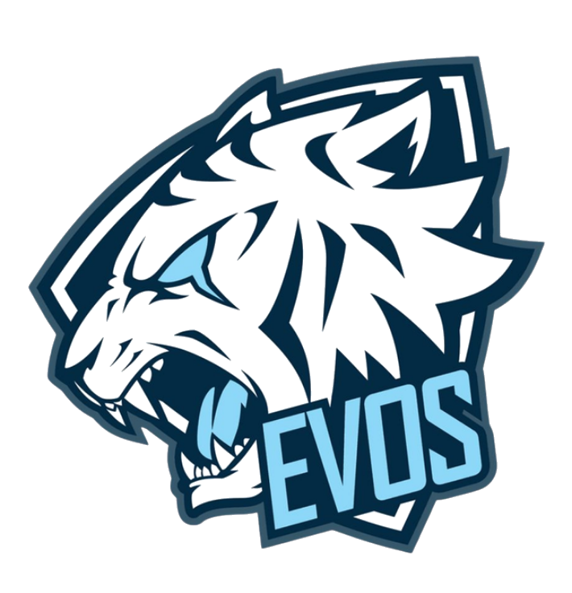

<p align="center">
  
</p>

<h1 align="center">EVOS Esports &bull; Operational Payroll System</h1>

<p align="center">
  <strong>Sistem Informasi Penggajian Roster & Operational Staff bertema EVOS Esports dengan Apple Clean UI/UX Design System.</strong>
</p>

<p align="center">
  <a href="https://laravel.com"></a>
  <a href="https://www.php.net"></a>
  <a href="https://tailwindcss.com"></a>
  <a href="https://alpinejs.dev"></a>
  <a href="https://spatie.be/open-source/packages/laravel-permission"></a>
</p>

---

## 📌 Ringkasan Proyek

**EVOS Esports Operational Payroll System** adalah aplikasi manajemen penggajian berbasis web yang dirancang khusus untuk mengelola finansial roster player, coach, analyst, dan staff operasional organisasi eSports (EVOS Esports).

Aplikasi ini menggabungkan **Estetika EVOS Esports (Blue Esports Theme)** dengan **Apple Clean UI Design System**, dilengkapi fitur **Dark / Light Mode Toggle**, kontras warna tinggi (WCAG AA compliant), serta pemformatan angka standar Rupiah Indonesia (menggunakan titik pemisah ribuan `2.000.000`).

---

## ✨ Fitur Utama

- ⚡ **Desain Visual Modern & Dual Mode Toggle (Dark / Light)**
  - Tombol beralih tema Bulan/Matahari (Sun/Moon) di navbar utama dengan penyimpanan preferensi di `localStorage` dan deteksi `prefers-color-scheme`.
  - Skema warna EVOS Blue (`#0052CC`), Cyan/Neon (`#00D2FF`), dan Dark Navy (`#051329`) dengan typography tebal dan mudah dibaca.

- 🎮 **Terminologi Khas Esports**
  - **Roster / Player & Staff** (Data Pegawai)
  - **Divisi Game** (Departemen: Mobile Legends, PUBG Mobile, Valorant, Free Fire, Content Creator)
  - **Role & Position** (Jabatan: Pro Player Main Roster, Coach, Analyst, Team Manager, Content Creator)
  - **Tunjangan & Gaji Pokok** (TETAP menggunakan istilah finansial baku)

- 💰 **Kalkulasi Penggajian Otomatis (Automatic Payroll Engine)**
  - Perhitungan **Gaji Pokok** dan **Tunjangan Tetap**.
  - **Insentif Masa Kerja**: Kalkulasi otomatis Rp 1.000.000 + Rp 100.000 per tahun masa kerja untuk karyawan berstatus Tetap.
  - **Upah Lembur**: Kalkulasi otomatis dari log presensi jam kerja (dengan rumus pembagi acuan 173 jam).
  - **Potongan NWNP (No Work No Pay)** untuk ketidakhadiran (Izin/Alpha).
  - **Potongan BPJS**: 3% dari (Gaji Pokok + Tunjangan Tetap).
  - **Total Take Home Pay (Gaji Bersih)** dikalkulasi secara instan via AJAX.

- 🇮🇩 **Pemformatan Standar Rupiah Indonesia (`2.000.000`)**
  - Pemformatan angka *real-time typing* pada form input dan tampilan slip gaji menggunakan titik sebagai pemisah ribuan dan koma untuk desimal (`22.593.930,64`).

- 🔒 **Role-Based Access Control (RBAC)**
  - **Supervisor Payroll**: Hak akses untuk meninjau, menyetujui (*Approve*), atau membatalkan draf slip penggajian.
  - **Staff Payroll**: Hak akses penuh untuk mengelola data roster, membuat draf penggajian, dan mengekspor slip gaji.

- 📄 **Cetak & Export Slip Gaji (DomPDF)**
  - Fitur preview dan download PDF slip gaji resmi berlogo EVOS Esports dengan watermark status (*DISETUJUI*, *DRAF*, *DIBATALKAN*).

- 🌱 **Database Seeder EVOS Esports**
  - Siap demonstrasi langsung dengan seeder dummy roster legendaris (Wannn, REKT, Oura, Branz, Flamtastic, Microboy, dll.).

---

## 🛠️ Teknologi & Dependensi

- **Framework**: Laravel 11.x (PHP 8.2+)
- **Database**: MySQL / MariaDB
- **Frontend / Styling**: Tailwind CSS, Vanilla CSS, Alpine.js, Lucide Icons
- **Data Tables**: Yajra Laravel DataTables 11.x
- **Access Control**: Spatie Laravel-Permission
- **PDF Generator**: Barryvdh DomPDF
- **HTML Form Builder**: Spatie HTML Builder

---

## 🚀 Panduan Instalasi & Pengoperasian

### 1. Prasyarat System
- PHP >= 8.2
- Composer >= 2.x
- Node.js & NPM (Opsional untuk asset compilation)
- MySQL / MariaDB Database Server

### 2. Clone Repository
```bash
git clone https://github.com/kinoestilllearn/aplikasi-penggajian.git
cd aplikasi-penggajian
```

### 3. Install Dependensi PHP
```bash
composer install
```

### 4. Konfigurasi Environment (`.env`)
Salin file `.env.example` menjadi `.env`:
```bash
cp .env.example .env
```
Buka file `.env` dan atur koneksi database Anda:
```env
DB_CONNECTION=mysql
DB_HOST=127.0.0.1
DB_PORT=3306
DB_DATABASE=aplikasi_penggajian
DB_USERNAME=root
DB_PASSWORD=
```

Generate Application Key:
```bash
php artisan key:generate
```

### 5. Jalankan Migrasi & Database Seeder
Jalankan migrasi database beserta seeder dummy bertema EVOS Esports:
```bash
php artisan migrate:fresh --seed
```

### 6. Jalankan Server Lokal
```bash
php artisan serve
```
Akses aplikasi melalui peramban web di: **`http://127.0.0.1:8000`**

---

## 🔑 Akun Demo bawaan (Default Login Credentials)

| Role / Jabatan | Email Access | Password |
| :--- | :--- | :--- |
| **Supervisor Payroll** | `supervisor@evos.gg` | `password` |
| **Staff Payroll** | `staff@evos.gg` | `password` |

---

## 🧪 pengujian Unit (Automated Testing)

Untuk menjalankan seluruh pengujian otomatis Laravel Test Suite:
```bash
php artisan test
```

---

## 📜 Lisensi & Hak Cipta

Proyek ini dikembangkan di bawah lisensi [MIT License](LICENSE).
Logo dan Branding EVOS Esports adalah hak cipta terdaftar milik PT Mau Maju EVOS Enterprise.
